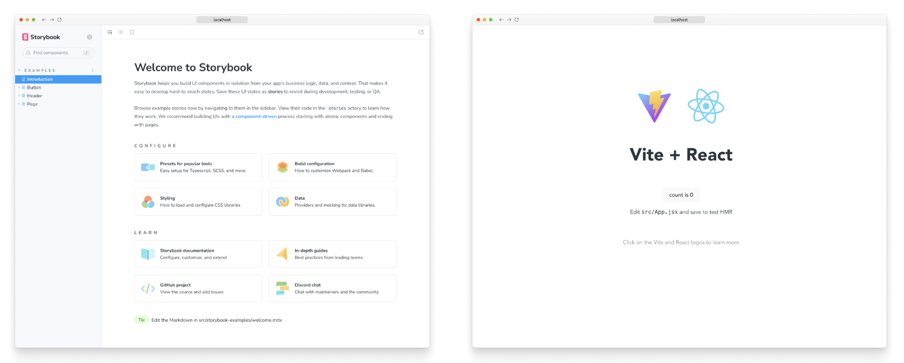

# React用Storybookチュートリアル
開発環境にStorybookをセットアップする

Storybookは開発モードでアプリと一緒に動作します。アプリのビジネスロジックやコンテキストから分離されたUIコンポーネントを構築するのに役立ちます。今回のStorybook入門チュートリアルはReact向けですが、React Native、Vue、Angular、Svelte、Ember向けもあります。

## React Storybookのセットアップ
私たちの環境でビルド・プロセスをセットアップするには、いくつかのステップを踏む必要がある。手始めに、degitを使ってビルドシステムをセットアップしたい。このパッケージを使うと、開発ワークフローを高速化するのに役立つ「テンプレート」（デフォルトの設定をいくつか含む、部分的にビルドされたアプリケーション）をダウンロードできます。

以下のコマンドを実行してみよう

```bash
# Clone the template
npx degit chromaui/intro-storybook-react-template taskbox

cd taskbox

# Install dependencies
yarn
```

* このテンプレートには、このバージョンのチュートリアルに必要なスタイル、アセット、必要最低限の設定が含まれています。

これで、アプリケーションのさまざまな環境が正しく動作していることをすぐに確認できます

```bash
# Start the component explorer on port 6006:
  yarn storybook

# Run the frontend app proper on port 5173:
yarn dev
```

私たちの主なフロントエンドアプリの様式：コンポーネント開発（Storybook）とアプリケーションそのもの。



アプリのどの部分で作業しているかにもよるが、これらのうちの1つ以上を同時に実行したい場合もあるだろう。現在フォーカスしているのは単一のUIコンポーネントを作成することなので、Storybookの実行にこだわることにする。

