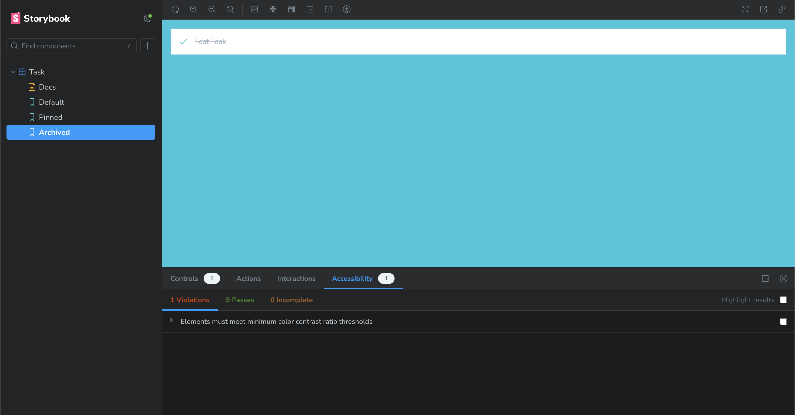

# 単純なコンポーネントを作る
シンプルなコンポーネントを単独でビルドする

コンポーネント駆動開発（CDD）の方法論に従ってUIを構築します。これはUIを「ボトムアップ」で構築するプロセスで、コンポーネントから始まり、スクリーンで終わります。CDDは、UIを構築するときに直面する複雑さの量を調整するのに役立ちます。

## タスク

タスクは私たちのアプリのコア・コンポーネントです。それぞれのタスクは、どのような状態にあるかによって表示が少し異なります。チェックされた（もしくはチェックされていない）チェックボックス、タスクに関するいくつかの情報、そして 「pin 」ボタンを表示し、タスクをリストの上下に移動できるようにします。これをまとめるには、これらの小道具が必要です：

* title - タスクを説明する文字列
* state - タスクが現在どのリストにあり、チェックされているか？

タスクのビルドを始めるにあたり、まず、上でスケッチしたさまざまなタイプのタスクに対応するテストステートを書きます。それから、Storybookを使って、モックデータを使ってコンポーネントを単独で作成します。各ステートでコンポーネントの外観を手動でテストしながら進めていきます。

## セットアップ
まず、タスクコンポーネントとそれに付随するストーリーファイル（src/components/Task.jsxとsrc/components/Task.stories.jsx）を作成しましょう。

まず、タスクの基本的な実装から始めましょう。必要な属性と、タスクに対してできる2つのアクション（リスト間でタスクを移動させる）を取り込むだけです

```jsx
// src/components/Task.jsx

export default function Task({ task: { id, title, state }, onArchiveTask, onPinTask }) {
  return (
    <div className="list-item">
      <label htmlFor={`title-${id}`} aria-label={title}>
        <input type="text" value={title} readOnly={true} name="title" id={`title-${id}`} />
      </label>
    </div>
  );
}
```

上では、Todosアプリケーションの既存のHTML構造に基づいて、Taskのためのわかりやすいマークアップをレンダリングしています。

以下では、ストーリーファイルにTaskの3つのテスト状態を作成します

```jsx
// src/components/Task.stories.jsx


import { fn } from "@storybook/test";

import Task from './Task';

export const ActionsData = {
  onArchiveTask: fn(),
  onPinTask: fn(),
};

export default {
  component: Task,
  title: 'Task',
  tags: ['autodocs'],
  //👇 Our exports that end in "Data" are not stories.
  excludeStories: /.*Data$/,
  args: {
    ...ActionsData,
  },
};

export const Default = {
  args: {
    task: {
      id: '1',
      title: 'Test Task',
      state: 'TASK_INBOX',
    },
  },
};

export const Pinned = {
  args: {
    task: {
      ...Default.args.task,
      state: 'TASK_PINNED',
    },
  },
};

export const Archived = {
  args: {
    task: {
      ...Default.args.task,
      state: 'TASK_ARCHIVED',
    },
  },
};
```

💡アクションは、UIコンポーネントを単独で構築する際のインタラクションの検証に役立ちます。アプリのコンテキストで持っている関数やステートにアクセスできないことがよくあります。fn()を使って、それらをスタブしてください。

Storybookには、コンポーネントとその子ストーリーの2つの基本的な構成レベルがあります。各ストーリーはコンポーネントの順列だと考えてください。1つのコンポーネントにつき、必要な数のストーリーを持つことができます。

* コンポーネント
  * ストーリー
  * ストーリー
  * ストーリー

STORYBOOKに文書化とテストを行っているコンポーネントを伝えるために、以下のようなデフォルトのエクスポートを作成します：

* component -- コンポーネントそのもの
* title -- Storybookのサイドバーでコンポーネントをグループ化または分類する方法
* tags -- コンポーネントのドキュメントを自動的に生成する
* excludeStories -- ストーリーに必要だが、ストーリーブックでレンダリングされるべきではない追加情報
* args -- コンポーネントがカスタムイベントをモックアウトするアクションの引数を定義します。

ストーリーを定義するために、Component Story Format 3（別名 CSF3 ）を使用して各テストケースを作成します。このフォーマットは、各テストケースを簡潔に作成するように設計されています。各コンポーネントの状態を含むオブジェクトをエクスポートすることで、テストをより直感的に定義し、ストーリーをより効率的に作成、再利用することができます。

fn()を使うと、クリックされたときにStorybook UIのActionsパネルに表示されるコールバックを作成できます。そのため、ピンボタンを作成するときに、ボタンのクリックが成功したかどうかをUIで判断できるようになります。

コンポーネントのすべての組み合わせに同じアクションセットを渡す必要があるので、それらを1つのActionsData変数にまとめて、毎回ストーリー定義に渡すと便利です。コンポーネントが必要とするActionsDataをバンドルするもう一つの良い点は、後で説明するように、それらをエクスポートして、このコンポーネントを再利用するコンポーネントのストーリーで使用できることです。

ストーリーを作成するとき、コンポーネントが期待するタスクの形を構築するためにベースタスクのargを使用する。通常、実際のデータがどのように見えるかをモデル化する。繰り返しになるが、このシェイプをエクスポートすることで、後のストーリーで再利用できるようになる。

## 設定
Storybookの設定ファイルをいくつか変更して、最近作成されたストーリーを認識し、アプリケーションのCSSファイル（src/index.cssにあります）を使用できるようにします。

まず、Storybookの設定ファイル（.storybook/main.js）を以下のように変更してください

```javascript
// .storybook/main.js

/** @type { import('@storybook/react-vite').StorybookConfig } */
const config = {
 stories: ['../src/components/**/*.stories.@(js|jsx)'],
  staticDirs: ['../public'],
  addons: [
    '@storybook/addon-links',
    '@storybook/addon-essentials',
    '@storybook/addon-interactions',
  ],
  framework: {
    name: '@storybook/react-vite',
    options: {},
  },
};
export default config;
```

上記の変更が完了したら、.storybookフォルダの中のpreview.jsを以下のように変更してください

```javascript
// .storybook/preview.js

import '../src/index.css';

//👇 Configures Storybook to log the actions( onArchiveTask and onPinTask ) in the UI.
/** @type { import('@storybook/react').Preview } */
const preview = {
  parameters: {
    controls: {
      matchers: {
        color: /(background|color)$/i,
        date: /Date$/,
      },
    },
  },
};

export default preview;
```

パラメータは通常、Storybookの機能やアドオンの動作を制御するために使用されます。今回のケースでは、そのような目的で使用することはありません。代わりに、アプリケーションの CSS ファイルをインポートします。

これを行った後、Storybookサーバを再起動すると、3つのTask状態のテストケースが得られるはずです

## ステートを構築する
Storybookのセットアップ、スタイルのインポート、テストケースのビルドができたので、デザインに合わせてコンポーネントのHTMLの実装をすぐに始めることができます。

現時点では、コンポーネントはまだ初歩的なものです。まずは、あまり細かいことは考えずに、デザインを実現するコードを書きましょう

```jsx
// src/components/Task.jsx

export default function Task({ task: { id, title, state }, onArchiveTask, onPinTask }) {
  return (
    <div className={`list-item ${state}`}>
      <label
        htmlFor={`archiveTask-${id}`}
        aria-label={`archiveTask-${id}`}
        className="checkbox"
      >
        <input
          type="checkbox"
          disabled={true}
          name="checked"
          id={`archiveTask-${id}`}
          checked={state === "TASK_ARCHIVED"}
        />
        <span
          className="checkbox-custom"
          onClick={() => onArchiveTask(id)}
        />
      </label>

      <label htmlFor={`title-${id}`} aria-label={title} className="title">
        <input
          type="text"
          value={title}
          readOnly={true}
          name="title"
          id={`title-${id}`}
          placeholder="Input title"
        />
      </label>
      {state !== "TASK_ARCHIVED" && (
        <button
          className="pin-button"
          onClick={() => onPinTask(id)}
          id={`pinTask-${id}`}
          aria-label={`pinTask-${id}`}
          key={`pinTask-${id}`}
        >
          <span className={`icon-star`} />
        </button>
      )}
    </div>
  );
}
```

上で追加したマークアップと、先ほどインポートしたCSSを組み合わせると、以下のようなUIになる


## データ要件を指定する
ReactでpropTypesを使用して、コンポーネントが期待するデータの形を指定するのがベストプラクティスだ。自己文書化できるだけでなく、問題の早期発見にも役立ちます。

```jsx
// src/components/Task.jsx

import PropTypes from 'prop-types';

export default function Task({ task: { id, title, state }, onArchiveTask, onPinTask }) {
  return (
    <div className={`list-item ${state}`}>
      <label
        htmlFor={`archiveTask-${id}`}
        aria-label={`archiveTask-${id}`}
        className="checkbox"
      >
        <input
          type="checkbox"
          disabled={true}
          name="checked"
          id={`archiveTask-${id}`}
          checked={state === "TASK_ARCHIVED"}
        />
        <span
          className="checkbox-custom"
          onClick={() => onArchiveTask(id)}
        />
      </label>

      <label htmlFor={`title-${id}`} aria-label={title} className="title">
        <input
          type="text"
          value={title}
          readOnly={true}
          name="title"
          id={`title-${id}`}
          placeholder="Input title"
        />
      </label>
      {state !== "TASK_ARCHIVED" && (
        <button
          className="pin-button"
          onClick={() => onPinTask(id)}
          id={`pinTask-${id}`}
          aria-label={`pinTask-${id}`}
          key={`pinTask-${id}`}
        >
          <span className={`icon-star`} />
        </button>
      )}
    </div>
  );
}
Task.propTypes = {
  /** Composition of the task */
  task: PropTypes.shape({
    /** Id of the task */
    id: PropTypes.string.isRequired,
    /** Title of the task */
    title: PropTypes.string.isRequired,
    /** Current state of the task */
    state: PropTypes.string.isRequired,
  }),
  /** Event to change the task to archived */
  onArchiveTask: PropTypes.func,
  /** Event to change the task to pinned */
  onPinTask: PropTypes.func,
};
```

これで、Taskコンポーネントが誤用された場合、開発時に警告が表示されるようになります。

💡 同じ目的を達成する別の方法は、TypeScriptのようなJavaScriptの型システムを使って、コンポーネントのプロパティ用の型を作成することです。

## コンポーネントが構築された！
これで、サーバーを必要とせず、フロントエンドのアプリケーション全体を実行することなく、コンポーネントを構築することに成功しました。次のステップは、残りのTaskboxコンポーネントを1つずつ同じようにビルドしていくことです。

お分かりのように、コンポーネントを分離して作り始めるのは簡単で速いです。可能性のあるすべての状態を掘り下げてテストすることができるので、バグが少なく、より洗練された質の高いUIを作ることが期待できます。

## アクセシビリティの問題を検出する
アクセシビリティ・テストとは、WCAGルールやその他の業界で認められているベストプラクティスに基づいた一連のヒューリスティックスに対して、自動化されたツールでレンダリングされたDOMを監査することを指します。アクセシビリティテストは、視覚障害、聴覚障害、認知障害などの障害者を含む、可能な限り多くの人々がアプリケーションを使用できるようにするために、あからさまなアクセシビリティ違反を検出するQAの第一線として機能します。

Storybookには公式のアクセシビリティアドオンが含まれています。Dequeのaxe-coreを搭載し、WCAGの問題の57%までキャッチできます。

どのように動作するか見てみましょう！以下のコマンドを実行してアドオンをインストールします

```bash
yarn add --dev @storybook/addon-a11y
```

その後、Storybookの設定ファイル（.storybook/main.js）を更新し、有効にします

```javascript
// .storybook/main.js

/** @type { import('@storybook/react-vite').StorybookConfig } */
const config = {
 stories: ['../src/components/**/*.stories.@(js|jsx)'],
  staticDirs: ['../public'],
  addons: [
    '@storybook/addon-links',
    '@storybook/addon-essentials',
    '@storybook/addon-interactions',
    '@storybook/addon-a11y',
  ],
  framework: {
    name: '@storybook/react-vite',
    options: {},
  },
};
export default config;
```

最後にStorybookを再起動すると、UIで新しいアドオンが有効になります。



ストーリーを循環させると、アドオンがテスト状態の1つにアクセシビリティの問題を発見したことがわかります。Elements must have sufficient color contrast（要素には十分な色のコントラストが必要です）」というメッセージは、本質的に、タスクのタイトルと背景の間に十分なコントラストがないことを意味します。アプリケーションのCSS（src/index.cssにあります）でテキストの色を濃いグレーに変更すれば、すぐに修正できます。

```css
/* src/index.css */

.list-item.TASK_ARCHIVED input[type="text"] {
  color: #4a5568;
  text-decoration: line-through;
}
```
以上です！UIがアクセシブルになるための第一歩を踏み出した。アプリケーションに複雑さを追加していけば、追加のツールやテスト環境を立ち上げることなく、他のすべてのコンポーネントに対してこのプロセスを繰り返すことができます。

💡 gitで変更をコミットすることを忘れないでください！
