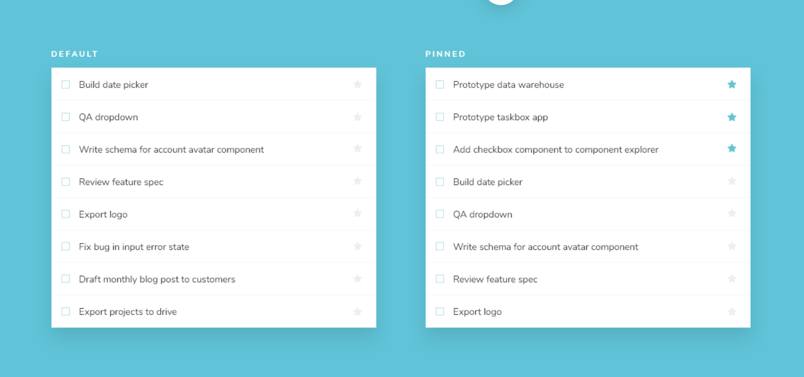

# 複合コンポーネントの組み立て
単純なコンポーネントから複合コンポーネントを組み立てる

前章では、最初のコンポーネントを作りました。この章では、学んだことを拡張して、タスクのリストであるTaskListを作ります。コンポーネントを組み合わせて、さらに複雑なものを作るとどうなるか見てみましょう。

## タスクリスト
Taskbox は、デフォルトのタスクの上に配置することで、ピン留めされたタスクを強調します。これにより、ストーリーを作成する必要がある TaskList のバリエーションがデフォルトとピン留めの 2 つになります。

タスク・データは非同期に送信できるので、接続がないときにレンダリングするローディング状態も必要です。さらに、タスクがないときのための空の状態も必要です。
