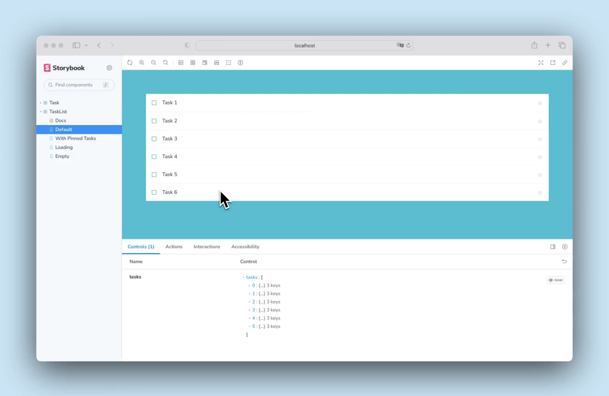

# 複合コンポーネントの組み立て
単純なコンポーネントから複合コンポーネントを組み立てる

前章では、最初のコンポーネントを作りました。この章では、学んだことを拡張して、タスクのリストであるTaskListを作ります。コンポーネントを組み合わせて、さらに複雑なものを作るとどうなるか見てみましょう。

## タスクリスト
Taskbox は、デフォルトのタスクの上に配置することで、ピン留めされたタスクを強調します。これにより、ストーリーを作成する必要がある TaskList のバリエーションがデフォルトとピン留めの 2 つになります。


タスク・データは非同期に送信できるので、接続がないときにレンダリングするローディング状態も必要です。さらに、タスクがないときのための空の状態も必要です。

## セットアップ
コンポジット・コンポーネントは、それを含む基本コンポーネントと大差ありません。
src/components/TaskList.jsx と src/components/TaskList.stories.jsx を作成します。

TaskListの大まかな実装から始めましょう。先ほどのTaskコンポーネントをインポートし、属性とアクションを入力として渡す必要があります。

```jsx
// src/components/TaskList.jsx

import Task from './Task';

export default function TaskList({ loading, tasks, onPinTask, onArchiveTask }) {
  const events = {
    onPinTask,
    onArchiveTask,
  };

  if (loading) {
    return <div className="list-items">loading</div>;
  }

  if (tasks.length === 0) {
    return <div className="list-items">empty</div>;
  }

  return (
    <div className="list-items">
      {tasks.map(task => (
        <Task key={task.id} task={task} {...events} />
      ))}
    </div>
  );
}
```

次に、ストーリー・ファイルにタスクリストのテスト状態を作成する。

```jsx
// src/components/TaskList.stories.jsx

import TaskList from './TaskList';

import * as TaskStories from './Task.stories';

export default {
  component: TaskList,
  title: 'TaskList',
  decorators: [(story) => <div style={{ margin: '3rem' }}>{story()}</div>],
  tags: ['autodocs'],
  args: {
    ...TaskStories.ActionsData,
  },
};

export const Default = {
  args: {
    // Shaping the stories through args composition.
    // The data was inherited from the Default story in Task.stories.jsx.
    tasks: [
      { ...TaskStories.Default.args.task, id: '1', title: 'Task 1' },
      { ...TaskStories.Default.args.task, id: '2', title: 'Task 2' },
      { ...TaskStories.Default.args.task, id: '3', title: 'Task 3' },
      { ...TaskStories.Default.args.task, id: '4', title: 'Task 4' },
      { ...TaskStories.Default.args.task, id: '5', title: 'Task 5' },
      { ...TaskStories.Default.args.task, id: '6', title: 'Task 6' },
    ],
  },
};

export const WithPinnedTasks = {
  args: {
    tasks: [
      ...Default.args.tasks.slice(0, 5),
      { id: '6', title: 'Task 6 (pinned)', state: 'TASK_PINNED' },
    ],
  },
};

export const Loading = {
  args: {
    tasks: [],
    loading: true,
  },
};

export const Empty = {
  args: {
    // Shaping the stories through args composition.
    // Inherited data coming from the Loading story.
    ...Loading.args,
    loading: false,
  },
};
```

💡 デコレーターは、ストーリーに任意のラッパーを提供する方法です。この例では、レンダリングされたコンポーネントの周囲に余白を追加するために、デフォルトのエクスポートでデコレーター・キーを使用しています。また、ストーリーを「プロバイダ」（Reactのコンテキストを設定するライブラリコンポーネント）でラップするために使用することもできます。

TaskStoriesをインポートすることで、最小限の労力でストーリーの引数（略してargs）を構成できるようになった。そうすることで、両方のコンポーネントが期待するデータとアクション（モックされたコールバック）は保持される。

では、新しいTaskListストーリーのStorybookを確認してください。

## 状態の構築
このコンポーネントはまだ荒削りだが、目指すべきストーリーは見えてきた。.list-itemsラッパーは単純すぎると思うかもしれません。ほとんどの場合、ラッパーを追加するためだけに新しいコンポーネントを作成することはありません。しかし、TaskListコンポーネントの本当の複雑さは、PinnedTasks、loading、emptyのエッジケースで明らかになります。

```jsx
// src/components/TaskList.jsx

import Task from './Task';

export default function TaskList({ loading, tasks, onPinTask, onArchiveTask }) {
  const events = {
    onPinTask,
    onArchiveTask,
  };
  const LoadingRow = (
    <div className="loading-item">
      <span className="glow-checkbox" />
      <span className="glow-text">
        <span>Loading</span> <span>cool</span> <span>state</span>
      </span>
    </div>
  );
  if (loading) {
    return (
      <div className="list-items" data-testid="loading" key={"loading"}>
        {LoadingRow}
        {LoadingRow}
        {LoadingRow}
        {LoadingRow}
        {LoadingRow}
        {LoadingRow}
      </div>
    );
  }
  if (tasks.length === 0) {
    return (
      <div className="list-items" key={"empty"} data-testid="empty">
        <div className="wrapper-message">
          <span className="icon-check" />
          <p className="title-message">You have no tasks</p>
          <p className="subtitle-message">Sit back and relax</p>
        </div>
      </div>
    );
  }

  const tasksInOrder = [
    ...tasks.filter((t) => t.state === 'TASK_PINNED'),
    ...tasks.filter((t) => t.state !== 'TASK_PINNED'),
  ];
  return (
    <div className="list-items">
      {tasksInOrder.map((task) => (
        <Task key={task.id} task={task} {...events} />
      ))}
    </div>
  );
}
```

マークアップを追加した結果、以下のようなUIになった



リスト内のピン留めされたアイテムの位置に注目してください。ピン留めされたアイテムをリストの一番上にレンダリングして、ユーザーにとって優先されるようにします。
