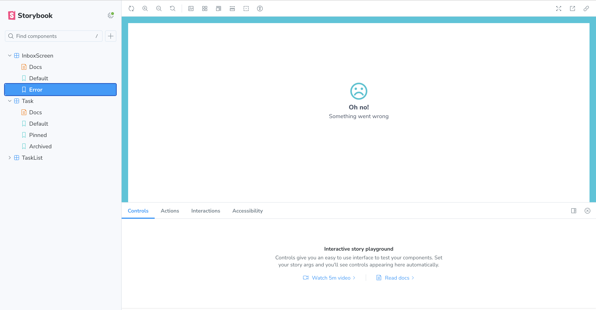
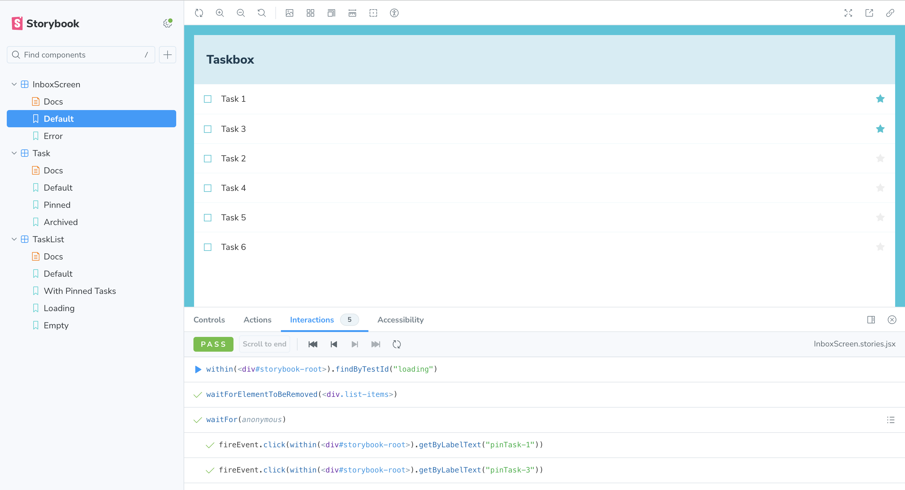
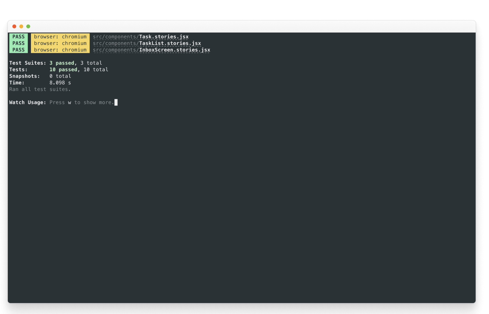

# スクリーンを作る
コンポーネントから画面を構成する

私たちは、UIをボトムアップで構築することに集中し、小さく始めて複雑さを加えてきました。そうすることで、各コンポーネントを個別に開発し、そのデータの必要性を把握し、Storybookで遊ぶことができるようになりました。サーバーを立ち上げたり、画面を構築したりする必要はありません！

この章では、画面内のコンポーネントを組み合わせ、その画面をStorybookで開発することで、さらに洗練度を高めていきます。

## 接続された画面
私たちのアプリは単純なので、これから作る画面はとても些細なもので、リモートAPIからデータを取得し、TaskListコンポーネント（Reduxから独自のデータを供給する）をラップし、Reduxからトップレベルのエラーフィールドを引き出すだけだ。

まずはReduxのストア（src/lib/store.js）を更新して、リモートAPIに接続し、アプリケーションのさまざまな状態（エラー、成功など）を処理できるようにします

```javascript
/* src/lib/store.js */

/* A simple redux store/actions/reducer implementation.
 * A true app would be more complex and separated into different files.
 */
import {
  configureStore,
  createSlice,
  createAsyncThunk,
} from '@reduxjs/toolkit';

/*
 * The initial state of our store when the app loads.
 * Usually, you would fetch this from a server. Let's not worry about that now
 */

const TaskBoxData = {
  tasks: [],
  status: 'idle',
  error: null,
};

/*
 * Creates an asyncThunk to fetch tasks from a remote endpoint.
 * You can read more about Redux Toolkit's thunks in the docs:
 * https://redux-toolkit.js.org/api/createAsyncThunk
 */
export const fetchTasks = createAsyncThunk('todos/fetchTodos', async () => {
  const response = await fetch(
    'https://jsonplaceholder.typicode.com/todos?userId=1'
  );
  const data = await response.json();
  const result = data.map((task) => ({
    id: `${task.id}`,
    title: task.title,
    state: task.completed ? 'TASK_ARCHIVED' : 'TASK_INBOX',
  }));
  return result;
});

/*
 * The store is created here.
 * You can read more about Redux Toolkit's slices in the docs:
 * https://redux-toolkit.js.org/api/createSlice
 */
const TasksSlice = createSlice({
  name: 'taskbox',
  initialState: TaskBoxData,
  reducers: {
    updateTaskState: (state, action) => {
      const { id, newTaskState } = action.payload;
      const task = state.tasks.findIndex((task) => task.id === id);
      if (task >= 0) {
        state.tasks[task].state = newTaskState;
      }
    },
  },
  /*
   * Extends the reducer for the async actions
   * You can read more about it at https://redux-toolkit.js.org/api/createAsyncThunk
   */
  extraReducers(builder) {
    builder
    .addCase(fetchTasks.pending, (state) => {
      state.status = 'loading';
      state.error = null;
      state.tasks = [];
    })
    .addCase(fetchTasks.fulfilled, (state, action) => {
      state.status = 'succeeded';
      state.error = null;
      // Add any fetched tasks to the array
      state.tasks = action.payload;
     })
    .addCase(fetchTasks.rejected, (state) => {
      state.status = 'failed';
      state.error = "Something went wrong";
      state.tasks = [];
    });
  },
});

// The actions contained in the slice are exported for usage in our components
export const { updateTaskState } = TasksSlice.actions;

/*
 * Our app's store configuration goes here.
 * Read more about Redux's configureStore in the docs:
 * https://redux-toolkit.js.org/api/configureStore
 */
const store = configureStore({
  reducer: {
    taskbox: TasksSlice.reducer,
  },
});

export default store;
```

さて、リモートAPIエンドポイントからデータを取得するためにストアを更新し、アプリの様々な状態を処理する準備をしたので、src/componentsディレクトリにInboxScreen.jsxを作成しよう

```jsx
// src/components/InboxScreen.jsx

import { useEffect } from 'react';

import { useDispatch, useSelector } from 'react-redux';

import { fetchTasks } from '../lib/store';

import TaskList from './TaskList';

export default function InboxScreen() {
  const dispatch = useDispatch();
  // We're retrieving the error field from our updated store
  const { error } = useSelector((state) => state.taskbox);
  // The useEffect triggers the data fetching when the component is mounted
  useEffect(() => {
    dispatch(fetchTasks());
  }, []);

  if (error) {
    return (
      <div className="page lists-show">
        <div className="wrapper-message">
          <span className="icon-face-sad" />
          <p className="title-message">Oh no!</p>
          <p className="subtitle-message">Something went wrong</p>
        </div>
      </div>
    );
  }
  return (
    <div className="page lists-show">
      <nav>
        <h1 className="title-page">Taskbox</h1>
      </nav>
      <TaskList />
    </div>
  );
}
```

また、InboxScreenをレンダリングするようにAppコンポーネントを変更する必要がある（最終的には、ルーターを使用して正しい画面を選択することになるが、ここでは気にしないでおこう）

```jsx
// src/App.jsx

import './index.css';
import store from './lib/store';

import { Provider } from 'react-redux';
import InboxScreen from './components/InboxScreen';

function App() {
  return (
   <Provider store={store}>
    <InboxScreen />
   </Provider>
  );
}
export default App;
```

しかし、面白くなるのはStorybookでストーリーをレンダリングするときだ。

```jsx
// src/components/InboxScreen.stories.jsx

import InboxScreen from './InboxScreen';
import store from '../lib/store';

import { Provider } from 'react-redux';

export default {
  component: InboxScreen,
  title: 'InboxScreen',
  decorators: [(story) => <Provider store={store}>{story()}</Provider>],
  tags: ['autodocs'],
};

export const Default = {};

export const Error = {};
```

前回見たように、TaskListコンポーネントは今やコネクテッド・コンポーネントであり、タスクをレンダリングするためにReduxストアに依存している。InboxScreenもコネクテッド・コンポーネントなので、同じようなことをして、ストーリーにストアを提供します。そこで、InboxScreen.stories.jsxにストーリーを設定します

エラー・ストーリーの問題はすぐに発見できる。正しい状態を表示する代わりに、タスクのリストを表示しているのだ。この問題を回避する1つの方法は、前章で行ったように、各状態に対してモックされたバージョンを提供することです。その代わりに、有名なAPIモッキング・ライブラリをStorybookアドオンと一緒に使うことで、この問題を解決します。


## APIサービスのモック
今回のアプリケーションはかなり単純で、リモートAPI呼び出しにあまり依存しないので、Mock Service WorkerとStorybookのMSWアドオンを使うことにする。Mock Service WorkerはAPIモッキング・ライブラリだ。サービス・ワーカーに依存してネットワーク・リクエストをキャプチャし、レスポンスにモック・データを提供する。

Get startedセクションでアプリをセットアップすると、両方のパッケージもインストールされた。あとは、これらを設定し、ストーリーを更新して使用するだけだ。

ターミナルで以下のコマンドを実行し、public フォルダ内に一般的なサービス ワーカーを生成します

```bash
yarn init-msw
```

```javascript
// .storybook/preview.js


import '../src/index.css';

// Registers the msw addon
import { initialize, mswLoader } from 'msw-storybook-addon';

// Initialize MSW
initialize();

//👇 Configures Storybook to log the actions( onArchiveTask and onPinTask ) in the UI.
/** @type { import('@storybook/react').Preview } */
const preview = {
  parameters: {
    controls: {
      matchers: {
        color: /(background|color)$/i,
        date: /Date$/,
      },
    },
  },
  loaders: [mswLoader],
};

export default preview;
```

最後に、InboxScreenストーリーを更新し、リモートAPIコールをモックするパラメーターを含める

```jsx
// src/components/InboxScreen.stories.jsx

import InboxScreen from './InboxScreen';

import store from '../lib/store';

import { http, HttpResponse } from 'msw';

import { MockedState } from './TaskList.stories';

import { Provider } from 'react-redux';

export default {
  component: InboxScreen,
  title: 'InboxScreen',
  decorators: [(story) => <Provider store={store}>{story()}</Provider>],
  tags: ['autodocs'],
};

export const Default = {
  parameters: {
    msw: {
      handlers: [
        http.get('https://jsonplaceholder.typicode.com/todos?userId=1', () => {
          return HttpResponse.json(MockedState.tasks);
        }),
      ],
    },
  },  
};

export const Error = {
  parameters: {
    msw: {
      handlers: [
        http.get('https://jsonplaceholder.typicode.com/todos?userId=1', () => {
          return new HttpResponse(null, {
            status: 403,
          });
        }),
      ],
    },
  },
};
```

余談だが、特にGraphQLを使う場合、データを階層下に渡すのは正当なアプローチだ。800以上のストーリーとともにChromaticを構築してきた方法だ。

ストーリーブックを確認すると、エラーストーリーが意図したとおりに動作していることがわかります。MSWはリモートAPIコールをインターセプトし、適切なレスポンスを提供しました。



## コンポーネントテスト
これまでのところ、私たちはシンプルなコンポーネントから画面まで、ゼロから完全に機能するアプリケーションを構築し、ストーリーを使用して各変更を継続的にテストすることができました。しかし、それぞれの新しいストーリーは、UIが壊れないことを確認するために、他のすべてのストーリーを手動でチェックする必要もある。これは多くの余分な作業だ。

このワークフローを自動化して、コンポーネントのインタラクションを自動的にテストできないだろうか？

### play機能を使ってコンポーネントテストを書く
Storybookのplayと@storybook/addon-interactionsはその手助けをしてくれる。play関数には、ストーリーのレンダリング後に実行される小さなコードの断片が含まれています。

play関数は、タスクが更新されたときにUIに何が起こるかを確認するのに役立ちます。フレームワークにとらわれないDOM APIを使用しているので、play関数を使ってストーリーを書くことで、フロントエンドのフレームワークに関係なくUIとインタラクションし、人間の行動をシミュレートすることができます。

storybook/addon-interactionsは、Storybookでテストを視覚化し、ステップバイステップのフローを提供するのに役立ちます。また、それぞれのインタラクションを一時停止、再開、巻き戻し、ステップ実行するための便利なUIコントロールのセットも提供します。

実際に使ってみましょう！新しく作成した InboxScreen ストーリーを更新し、以下を追加してコンポーネントのインタラクションを設定します

```jsx
// src/components/InboxScreen.stories.jsx

import InboxScreen from './InboxScreen';

import store from '../lib/store';

import { http, HttpResponse } from 'msw';

import { MockedState } from './TaskList.stories';

import { Provider } from 'react-redux';

 import {
  fireEvent,
  waitFor,
  within,
  waitForElementToBeRemoved
 } from '@storybook/test';

export default {
  component: InboxScreen,
  title: 'InboxScreen',
  decorators: [(story) => <Provider store={store}>{story()}</Provider>],
  tags: ['autodocs'],
};

export const Default = {
  parameters: {
    msw: {
      handlers: [
        http.get('https://jsonplaceholder.typicode.com/todos?userId=1', () => {
          return HttpResponse.json(MockedState.tasks);
        }),
      ],
    },
  },
  play: async ({ canvasElement }) => {
    const canvas = within(canvasElement);
    // Waits for the component to transition from the loading state
    await waitForElementToBeRemoved(await canvas.findByTestId('loading'));
    // Waits for the component to be updated based on the store
    await waitFor(async () => {
      // Simulates pinning the first task
      await fireEvent.click(canvas.getByLabelText('pinTask-1'));
      // Simulates pinning the third task
      await fireEvent.click(canvas.getByLabelText('pinTask-3'));
    });
  },
};

export const Error = {
  parameters: {
    msw: {
      handlers: [
        http.get('https://jsonplaceholder.typicode.com/todos?userId=1', () => {
          return new HttpResponse(null, {
            status: 403,
          });
        }),
      ],
    },
  },
};
```

💡 @So_1F4A1 パッケージは、@storybook/jest と @storybook/testing-library テストパッケージを置き換えるもので、より小さなバンドルサイズと、Vitest パッケージに基づいたより分かりやすい API を提供します。

デフォルトストーリーを確認する。インタラクションパネルをクリックすると、ストーリーの再生機能内のインタラクションのリストが表示されます。



### テストランナーでテストを自動化
Storybookの再生機能によって、私たちは問題を回避し、UIとインタラクションし、タスクを更新したときにどのように反応するかを素早くチェックすることができました。

しかし、ストーリーブックをよく見てみると、ストーリーを表示しているときだけインタラクションテストを実行していることがわかります。そのため、変更を加えた場合、すべてのチェックを実行するために各ストーリーを確認する必要がある。これを自動化できないだろうか？

良いニュースは、それができるということです！Storybookのテストランナーを使えばそれが可能です。これはPlaywrightで動くスタンドアローンのユーティリティで、すべてのインタラクションテストを実行し、壊れたストーリーを検出します。

どのように動作するか見てみましょう！次のコマンドを実行してインストールしてください

```bash
yarn add --dev @storybook/test-runner
```

次に、package.jsonスクリプトを更新し、新しいテストタスクを追加する

```json
{
  "scripts": {
    "test-storybook": "test-storybook"
  }
}
```

最後に、ストーリーブックを起動した状態で、新しいターミナルウィンドウを開き、以下のコマンドを実行する

```bash
yarn test-storybook --watch
```

💡 play関数を使ったコンポーネントテストは、UIコンポーネントをテストする素晴らしい方法です。ここで見た以上のことができます。公式ドキュメントを読んで、より詳しく学ぶことをお勧めします。

テストについてさらに深く掘り下げるには、テストハンドブックをご覧ください。このハンドブックでは、あなたの開発ワークフローを強化するために、スケーラブルなフロントエンドチームが使用するテスト戦略をカバーしています。



成功だ！これで、すべてのストーリーがエラーなしでレンダリングされ、すべてのアサーションが自動的にパスするかどうかを検証するツールが手に入った。さらに、テストが失敗した場合は、失敗したストーリーをブラウザで開くためのリンクを提供してくれる。
