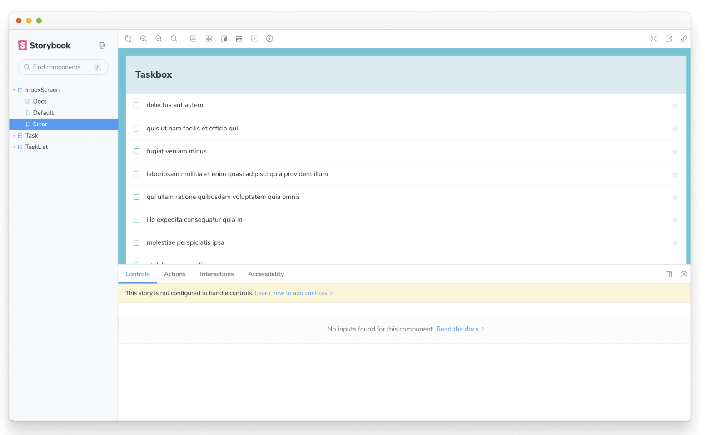

# スクリーンを作る
コンポーネントから画面を構成する

私たちは、UIをボトムアップで構築することに集中し、小さく始めて複雑さを加えてきました。そうすることで、各コンポーネントを個別に開発し、そのデータの必要性を把握し、Storybookで遊ぶことができるようになりました。サーバーを立ち上げたり、画面を構築したりする必要はありません！

この章では、画面内のコンポーネントを組み合わせ、その画面をStorybookで開発することで、さらに洗練度を高めていきます。

## 接続された画面
私たちのアプリは単純なので、これから作る画面はとても些細なもので、リモートAPIからデータを取得し、TaskListコンポーネント（Reduxから独自のデータを供給する）をラップし、Reduxからトップレベルのエラーフィールドを引き出すだけだ。

まずはReduxのストア（src/lib/store.js）を更新して、リモートAPIに接続し、アプリケーションのさまざまな状態（エラー、成功など）を処理できるようにします

```javascript
/* src/lib/store.js */

/* A simple redux store/actions/reducer implementation.
 * A true app would be more complex and separated into different files.
 */
import {
  configureStore,
  createSlice,
  createAsyncThunk,
} from '@reduxjs/toolkit';

/*
 * The initial state of our store when the app loads.
 * Usually, you would fetch this from a server. Let's not worry about that now
 */

const TaskBoxData = {
  tasks: [],
  status: 'idle',
  error: null,
};

/*
 * Creates an asyncThunk to fetch tasks from a remote endpoint.
 * You can read more about Redux Toolkit's thunks in the docs:
 * https://redux-toolkit.js.org/api/createAsyncThunk
 */
export const fetchTasks = createAsyncThunk('todos/fetchTodos', async () => {
  const response = await fetch(
    'https://jsonplaceholder.typicode.com/todos?userId=1'
  );
  const data = await response.json();
  const result = data.map((task) => ({
    id: `${task.id}`,
    title: task.title,
    state: task.completed ? 'TASK_ARCHIVED' : 'TASK_INBOX',
  }));
  return result;
});

/*
 * The store is created here.
 * You can read more about Redux Toolkit's slices in the docs:
 * https://redux-toolkit.js.org/api/createSlice
 */
const TasksSlice = createSlice({
  name: 'taskbox',
  initialState: TaskBoxData,
  reducers: {
    updateTaskState: (state, action) => {
      const { id, newTaskState } = action.payload;
      const task = state.tasks.findIndex((task) => task.id === id);
      if (task >= 0) {
        state.tasks[task].state = newTaskState;
      }
    },
  },
  /*
   * Extends the reducer for the async actions
   * You can read more about it at https://redux-toolkit.js.org/api/createAsyncThunk
   */
  extraReducers(builder) {
    builder
    .addCase(fetchTasks.pending, (state) => {
      state.status = 'loading';
      state.error = null;
      state.tasks = [];
    })
    .addCase(fetchTasks.fulfilled, (state, action) => {
      state.status = 'succeeded';
      state.error = null;
      // Add any fetched tasks to the array
      state.tasks = action.payload;
     })
    .addCase(fetchTasks.rejected, (state) => {
      state.status = 'failed';
      state.error = "Something went wrong";
      state.tasks = [];
    });
  },
});

// The actions contained in the slice are exported for usage in our components
export const { updateTaskState } = TasksSlice.actions;

/*
 * Our app's store configuration goes here.
 * Read more about Redux's configureStore in the docs:
 * https://redux-toolkit.js.org/api/configureStore
 */
const store = configureStore({
  reducer: {
    taskbox: TasksSlice.reducer,
  },
});

export default store;
```

さて、リモートAPIエンドポイントからデータを取得するためにストアを更新し、アプリの様々な状態を処理する準備をしたので、src/componentsディレクトリにInboxScreen.jsxを作成しよう

```jsx
// src/components/InboxScreen.jsx

import { useEffect } from 'react';

import { useDispatch, useSelector } from 'react-redux';

import { fetchTasks } from '../lib/store';

import TaskList from './TaskList';

export default function InboxScreen() {
  const dispatch = useDispatch();
  // We're retrieving the error field from our updated store
  const { error } = useSelector((state) => state.taskbox);
  // The useEffect triggers the data fetching when the component is mounted
  useEffect(() => {
    dispatch(fetchTasks());
  }, []);

  if (error) {
    return (
      <div className="page lists-show">
        <div className="wrapper-message">
          <span className="icon-face-sad" />
          <p className="title-message">Oh no!</p>
          <p className="subtitle-message">Something went wrong</p>
        </div>
      </div>
    );
  }
  return (
    <div className="page lists-show">
      <nav>
        <h1 className="title-page">Taskbox</h1>
      </nav>
      <TaskList />
    </div>
  );
}
```

また、InboxScreenをレンダリングするようにAppコンポーネントを変更する必要がある（最終的には、ルーターを使用して正しい画面を選択することになるが、ここでは気にしないでおこう）

```jsx
// src/App.jsx

import './index.css';
import store from './lib/store';

import { Provider } from 'react-redux';
import InboxScreen from './components/InboxScreen';

function App() {
  return (
   <Provider store={store}>
    <InboxScreen />
   </Provider>
  );
}
export default App;
```

しかし、面白くなるのはStorybookでストーリーをレンダリングするときだ。

```jsx
// src/components/InboxScreen.stories.jsx

import InboxScreen from './InboxScreen';
import store from '../lib/store';

import { Provider } from 'react-redux';

export default {
  component: InboxScreen,
  title: 'InboxScreen',
  decorators: [(story) => <Provider store={store}>{story()}</Provider>],
  tags: ['autodocs'],
};

export const Default = {};

export const Error = {};
```

前回見たように、TaskListコンポーネントは今やコネクテッド・コンポーネントであり、タスクをレンダリングするためにReduxストアに依存している。InboxScreenもコネクテッド・コンポーネントなので、同じようなことをして、ストーリーにストアを提供します。そこで、InboxScreen.stories.jsxにストーリーを設定します

エラー・ストーリーの問題はすぐに発見できる。正しい状態を表示する代わりに、タスクのリストを表示しているのだ。この問題を回避する1つの方法は、前章で行ったように、各状態に対してモックされたバージョンを提供することです。その代わりに、有名なAPIモッキング・ライブラリをStorybookアドオンと一緒に使うことで、この問題を解決します。


