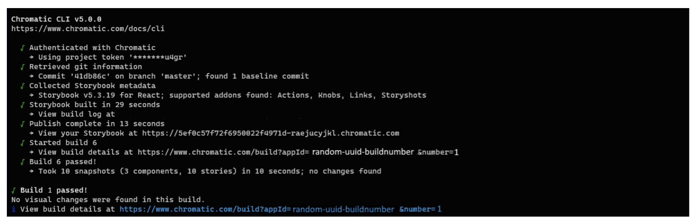

# Storybookのデプロイ
Storybookをオンラインでデプロイする方法を学びます。
このチュートリアルでは、ローカルの開発マシン上でコンポーネントを作成しました。ある時点で、チームのフィードバックを得るために作業を共有する必要が出てきます。チームメイトがUIの実装をレビューできるように、Storybookをオンラインにデプロイしてみましょう。

## 静的アプリとしてエクスポート
Storybookをデプロイするには、まず静的ウェブアプリとしてエクスポートする必要があります。この機能はすでにStorybookに組み込まれており、あらかじめ設定されています。

yarn build-storybookを実行すると、storybook-staticディレクトリに静的なStorybookが出力されます。

## ストーリーブックを公開する
このチュートリアルでは、Storybookのメンテナによって作られた無料のパブリッシングサービス、Chromaticを使用します。Chromaticを利用することで、Storybookを安全かつセキュアにクラウド上にデプロイし、ホストすることができます。

### GitHubでリポジトリをセットアップする
作業を始める前に、ローカルのコードをリモートのバージョン管理サービスと同期させる必要があります。はじめに の章でプロジェクトをセットアップしたときに、すでにローカルリポジトリを初期化しています。この段階では、リモートリポジトリにプッシュできるコミットのセットがすでにできています。

GitHub にアクセスし、プロジェクトのリポジトリを新規作成します。リポジトリ名はローカルプロジェクトと同じ 「taskbox」 とします。

新しいレポで、レポのオリジンURLを取得し、次のコマンドでgitプロジェクトに追加します

```bash
git remote add origin https://github.com/<your username>/taskbox.git
```

最後に、ローカル・レポをGitHubのリモート・レポにプッシュする

### Chromaticを入手する
開発依存としてパッケージを追加する。

```bash
yarn add -D chromatic
```

パッケージのインストールが完了したら、GitHubアカウントでChromaticにログインします（Chromaticは軽量なパーミッションのみを要求します）。

Collaborators の下にある Choose GitHub repo をクリックし、リポジトリを選択します。

プロジェクト用に生成された一意の project-token をコピーします。そして、コマンドラインで以下のように実行し、Storybookをビルドしてデプロイします。project-token をプロジェクトトークンに置き換えてください。

```bash
yarn chromatic --project-token=<project-token>
```



完了すると、公開されたストーリーブックへのリンク（https://random-uuid.chromatic.com）が表示されます。このリンクをチームで共有し、フィードバックをもらいましょう。

万歳！Storybookは1つのコマンドで公開したが、UI実装のフィードバックを得たいときに毎回手動でコマンドを実行するのは繰り返しになる。理想を言えば、コードをプッシュするたびに最新バージョンのコンポーネントをパブリッシュすることだ。Storybookを継続的にデプロイする必要がある。

## Chromaticを使った継続的デプロイ
GitHub リポジトリにプロジェクトをホスティングしたので、継続的インテグレーション (CI) サービスを使って Storybook を自動デプロイしてみましょう。GitHub Actions は GitHub に組み込まれている無料の CI サービスで、自動公開が簡単にできます。

### GitHub アクションを追加して Storybook をデプロイする
プロジェクトのルートフォルダに .github という新しいディレクトリを作成し、その中に別の workflows ディレクトリを作成します。

以下のようなchromatic.ymlというファイルを新規作成します。

```yml
# .github/workflows/chromatic.yml

# Workflow name
name: 'Chromatic Deployment'

# Event for the workflow
on: push

# List of jobs
jobs:
  chromatic:
    name: 'Run Chromatic'
    runs-on: ubuntu-latest
    # Job steps
    steps:
      - uses: actions/checkout@v4
        with:
          fetch-depth: 0
      - run: yarn
        #👇 Adds Chromatic as a step in the workflow
      - uses: chromaui/action@latest
        # Options required for Chromatic's GitHub Action
        with:
          #👇 Chromatic projectToken, see https://storybook.js.org/tutorials/intro-to-storybook/react/en/deploy/ to obtain it
          projectToken: ${{ secrets.CHROMATIC_PROJECT_TOKEN }}
          token: ${{ secrets.GITHUB_TOKEN }}
```

💡 簡潔にするために GitHub のシークレットについては触れませんでした。シークレットとは GitHub が提供する安全な環境変数のことで、プロジェクト・トークンをハードコードする必要がなくなります。