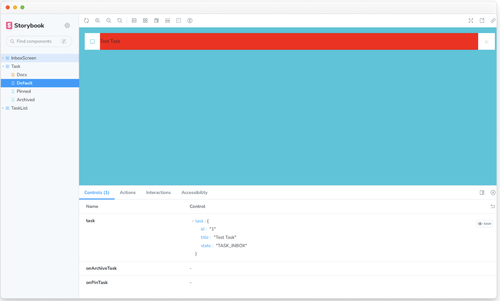
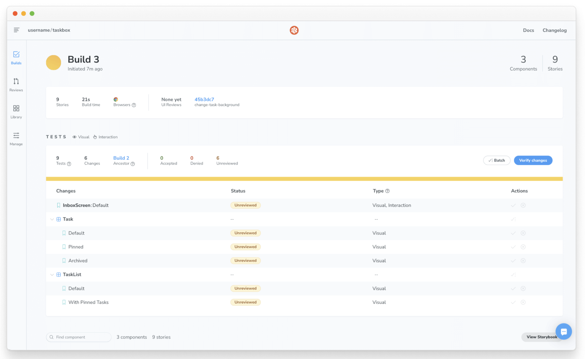

# ビジュアル・テスト
UIコンポーネントのテスト方法を学ぶ
Storybookのチュートリアルはテストなしでは完結しません。テストは高品質のUIを作成するために不可欠です。モジュラーシステムでは、わずかな調整が大きなリグレッションにつながる可能性があります。これまで、私たちは3種類のテストに遭遇してきました

* 手動テストは、コンポーネントの正しさを検証するために、開発者が手動でコンポーネントを見ることに依存する。手動テストは、開発者がコンポーネントを手動で見て、正しさを確認するのに役立ちます。
* a11yアドオンによるアクセシビリティテストは、コンポーネントが誰にでもアクセス可能であることを検証します。これは、ある種の障害を持つ人々がどのようにコンポーネントを使用するかについての情報を収集するのに適しています。
* play機能によるコンポーネントテストは、コンポーネントとインタラクトしたときにコンポーネントが期待通りに動作するかを検証します。コンポーネントが使用されているときの動作をテストするのに最適です。

## 「でも、ちゃんと見える？」
残念ながら、前述のテスト方法だけではUIのバグを防ぐには不十分だ。デザインは主観的でニュアンスが異なるため、UIのテストは厄介だ。手動テストは、まあ手動だ。スナップショットテストのような他のUIテストは誤検出が多すぎるし、ピクセルレベルのユニットテストは評価が低い。完全なストーリーブックのテスト戦略には、視覚的なリグレッションテストも含まれる。

## ストーリーブックのビジュアルテスト
ビジュアルリグレッションテストはビジュアルテストとも呼ばれ、見た目の変更をキャッチするように設計されています。すべてのストーリーのスクリーンショットをキャプチャし、コミットごとに比較することで、変更を表面化します。レイアウト、色、サイズ、コントラストのようなグラフィカルな要素の検証に最適です。

ストーリーブックは、ビジュアルなリグレッションテストのための素晴らしいツールです。ストーリーを書いたり更新したりするたびに、無料で仕様書を手に入れることができる！

ビジュアル回帰テスト用のツールはいくつかあります。私たちは、Storybookのメンテナによって作られた、ビジュアルテストを高速なクラウドブラウザ環境で実行する無料のパブリッシングサービス、Chromaticを推奨する。また、前の章で見たように、Storybookをオンラインで公開することもできます。

## UIの変更をキャッチする
ビジュアル回帰テストは、新しくレンダリングされたUIコードの画像をベースラインの画像と比較することに依存しています。UIの変更が検出されれば、通知が届く。

Task コンポーネントの背景をいじってみましょう。

まず、この変更のために新しいブランチを作成します

```bash
git checkout -b change-task-background
```

src/components/Task.jsxを以下のように変更する

```jsx
// src/components/Task.jsx

export default function Task({ task: { id, title, state }, onArchiveTask, onPinTask }) {
  return (
    <div className={`list-item ${state}`}>
      <label
        htmlFor={`archiveTask-${id}`}
        aria-label={`archiveTask-${id}`}
        className="checkbox"
      >
        <input
          type="checkbox"
          disabled={true}
          name="checked"
          id={`archiveTask-${id}`}
          checked={state === "TASK_ARCHIVED"}
        />
        <span
          className="checkbox-custom"
          onClick={() => onArchiveTask(id)}
        />
      </label>

      <label htmlFor={`title-${id}`} aria-label={title} className="title">
        <input
          type="text"
          value={title}
          readOnly={true}
          name="title"
          id={`title-${id}`}
          placeholder="Input title"
          style={{ backgroundColor: 'red' }}
        />
      </label>

      {state !== "TASK_ARCHIVED" && (
        <button
          className="pin-button"
          onClick={() => onPinTask(id)}
          id={`pinTask-${id}`}
          aria-label={`pinTask-${id}`}
          key={`pinTask-${id}`}
        >
          <span className={`icon-star`} />
        </button>
      )}
    </div>
  );
}
```
これにより、アイテムの新しい背景色が得られます。



ファイルを追加する

```bash
git add .
```

コミットする
```bash
git commit -m "change task background to red"
```

リモートリポジトリに変更をプッシュする
```bash
git push -u origin change-task-background
```

最後に GitHub リポジトリを開き、change-task-background ブランチのプルリクエストをオープンします。

プルリクエストに説明文を追加し、プルリクエストの作成をクリックします。ページ下部の「UI Tests」のPRチェックをクリックします。

あなたのコミットによるUIの変更が表示されます。



変更点はたくさんある！TaskがTaskListやInboxの子であるというコンポーネント階層は、1つの小さな調整が大きなリグレッションに雪だるま式に膨れ上がることを意味する。このような状況こそが、開発者が他のテスト手法に加えて視覚的なリグレッションテストを必要とする理由なのです。
